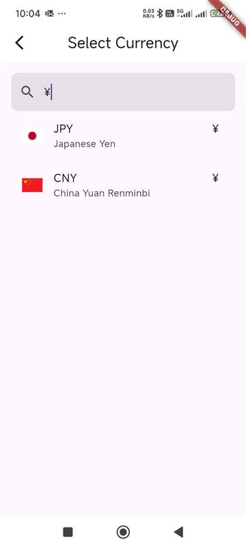
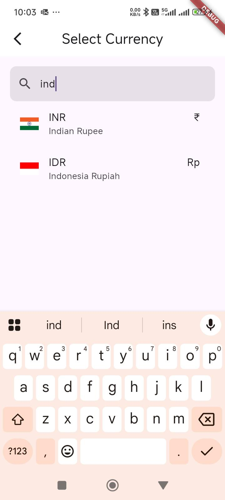
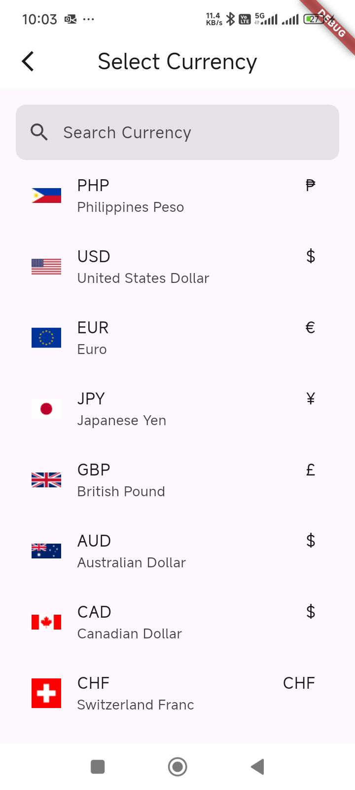

<!--
This README describes the package. If you publish this package to pub.dev,
this README's contents appear on the landing page for your package.

For information about how to write a good package README, see the guide for
[writing package pages](https://dart.dev/tools/pub/writing-package-pages).

For general information about developing packages, see the Dart guide for
[creating packages](https://dart.dev/guides/libraries/create-packages)
and the Flutter guide for
[developing packages and plugins](https://flutter.dev/to/develop-packages).
-->


# Currency Pick

## Description
`currency_pick` is a Flutter package that allows users to select currencies easily. It provides a user-friendly dropdown or dialog interface to pick a currency, returning details like currency name, symbol, and code.

## Features
- List of global currencies
- Currency name, symbol,decimal_digits,number,name_plural and code
- Customizable UI
- Lightweight and easy to integrate

## Images






## Installation
Add the following dependency to your `pubspec.yaml`:

```yaml
dependencies:
  currency_pick: latest_version
```

Then run:
```sh
flutter pub get
```

## Usage
Import the package:
```dart
import 'package:currency_pick/currency_pick.dart';
```

### Example Usage
```dart
CustomCurrency(
initialValue: "INR",
onSaved: (value) {
setState(() {
totalValueObj=value;
});
},
)
```

## Customization
You can customize the appearance using optional parameters:
```dart
CustomCurrency(
initialValue: "INR",
onSaved: (value) {
setState(() {
totalValueObj=value;
});
},
appBar: AppBar(title: Text("Select Currency"),),
boxDecoration: BoxDecoration(color: Colors.red),
countryTextStyle: TextStyle(),
symbolTextStyle: TextStyle(),
)
);
```


### Android Version 11 Issue
If some currency symbols are not supported in Android version 11, you can use the following font family to override the issue:
```dart
TextStyle(
fontFamily: 'NotoSans',
);
```

## Contributions
Feel free to contribute by submitting issues or pull requests on GitHub.

## License
This package is released under the MIT License.


